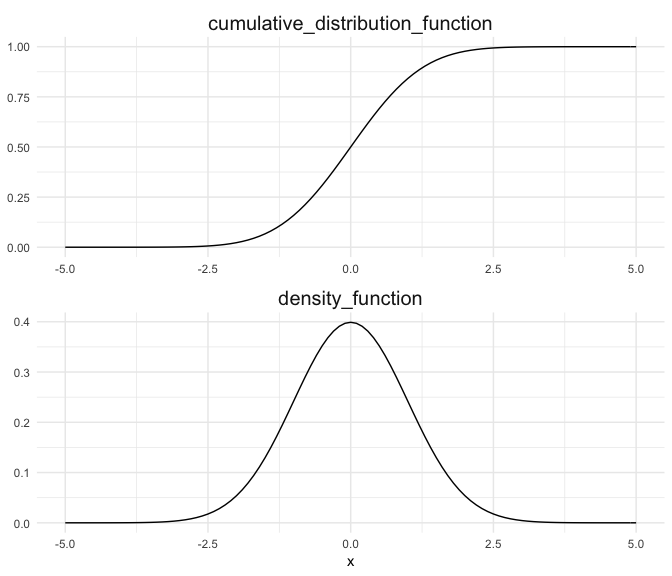

描き途中（間に合わなかった）

## 1. 確率

### 写像

集合$x$に含まれる要素$x$に対し、集合$Y$に含まれる要素$y$が1つに定まるとき、この対応関係を写像$f$と呼ぶ。

$$
f:X \to Y  \tag{1}
$$

### 標本空間Ω

今想定されている事柄の全てを含む空間を**標本空間**$\Omega$とする。

### 根元事象ω

$\Omega$に含まれる最小単位を$\omega$とする。この$\omega$の事を**根元事象**(もしくは標本, 標本点など)と呼ぶ。

### 事象A

ここで、標本空間$\Omega$の部分集合族$\mathcal{F}$を定義し、$\mathcal{F}$の要素を**事象**$A$とする。

$$
\begin{eqnarray}
&&\mathcal{F}\subseteq\Omega\\
&&\mathcal{F}=\{A_1, A_2, ..., A_N\}
\end{eqnarray}
$$

直感的には、標本空間をいくつかの事象に分割するその分け方を$\mathcal{F}$と置いている。
ただし次の条件を満たすものとする。

$$
\begin{eqnarray}
&&\mathcal{F} \neq \varnothing\\
&&A \in \mathcal{F} &\Rightarrow \bar{A} \in \mathcal{F}\\
&&A_{i} \in \mathcal{F} &\Rightarrow \bigcup_{i} A_{i} \in \mathcal{F}\ (i \in 1, 2, ..., N)
\end{eqnarray}
$$

この時、$\mathcal{F}$が**σ加法族**をつくる（もしくはボレル集合体である）、と言う。

書き下すと、事象は空集合ではない、事象の補集合もまた事象である、事象の要素の加算和もまた事象である。

### 確率p

**確率**$p$は、σ加法族をつくる$\mathcal{F}$を区間$[0,1]$に写像した結果の値である。

この写像を$P$とし、**確率測度**と呼ぶ。これは以下の性質を満たす。

$$
\begin{eqnarray}
&&P:\mathcal{F} \rightarrow [0,1]\\
&&P(\Omega)=1\\
&&\forall (A_i \cap A_j)=\varnothing \Rightarrow P\Big(\bigcup_i A_i\Big) = \sum_i P(A_i) \ \ \ (i, j \in 1, 2, ..., N,\ i\neq j)
\end{eqnarray}
$$

この時、$(\Omega, \mathcal{F}, P)$を**確率空間**と呼ぶ。

## 2. 確率変数


## 3. 正規分布

### 確率変数Xは正規分布に従う

$$
X \sim Normal(\mu, \sigma^2) \tag{1}
$$


$$
X \sim \mathcal{N}(\mu, \sigma^2) \tag{2}
$$

### 確率密度関数 (probability density function, PDF)

$$
f(x) = \frac{1}{\sqrt{2\pi\sigma^2}}\ \exp{\Big[-\frac{(x-\mu)^2}{2\sigma^2}\Big]},\ \ x\in \mathbb{R} \tag{3}
$$

$$
p(a≤x≤b) =\int_a^bf(x)dx \tag{4}
$$
サンプルデータ


```r
.mu <- 0
.sd <- 1
.bin <- 0.1

dat_n <- data.frame(x = seq(-5, 5, by = .bin)) %>% 
  mutate(d = dnorm(x, .mu, .sd),
         q = pnorm(x, .mu, .sd))
```

可視化


```r
dat_n %>% 
  rename(density_function = d,
         cumulative_distribution_function = q) %>% 
  gather(key, val, -x) %>% 
  ggplot(aes(x, val))+
  geom_path()+
  facet_wrap(~key, ncol = 1, scales = "free")+
  theme_minimal()+
  theme(axis.title.y = element_blank(),
        strip.text = element_text(size = 15))
```

<!-- -->
